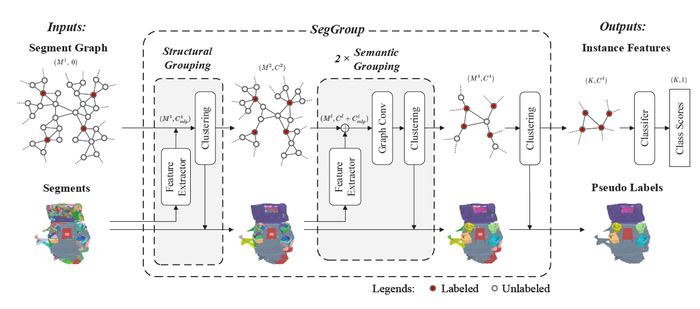

# SegGroup

<p float="left">
    
</p>

This repository contains the PyTorch implementation for paper **SegGroup: Seg-Level Supervision for 3D Instance and Semantic Segmentation**

**Authors:** An Tao, Yueqi Duan, Yi Wei, Jiwen Lu, Jie Zhou

[[arxiv]](https://arxiv.org/abs/2012.10217)

If you find our work useful in your research, please consider citing:
```
@article{tao2020seggroup,
  title={{SegGroup}: Seg-Level Supervision for {3D} Instance and Semantic Segmentation},
  author={Tao, An and Duan, Yueqi and Wei, Yi and Lu, Jiwen and Zhou, Jie},
  journal={arXiv preprint},
  year={2020}
}
```

Our annotation tool is in [AnTao97/SegGroup.annotator](https://github.com/AnTao97/SegGroup.annotator).

&nbsp;
## Usage
### Requirements
- Python 3.7
- PyTorch 1.2

The code will be released soon.
