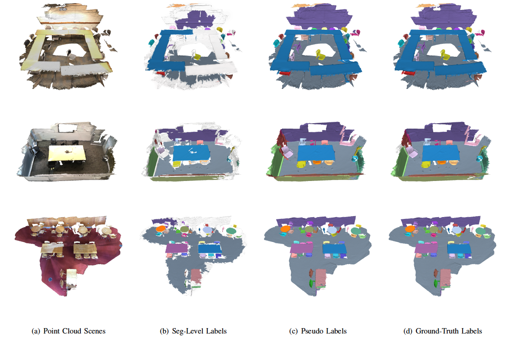

# Pseudo label generation from SegGroup

[[中文版]](README_zh.md)

<p float="left">
    
</p>

This folder contains codes for generating point-level pseudo labels given our seg-level labels. The generated pseudo labels can be used to replace the ground-truth labels in the fully-supervised training of a standard point cloud segmentation model.

&nbsp;

## Requirements

- Python 3.7
- PyTorch 1.2
- CUDA 10.0
- Package: glob, h5py, sklearn, plyfile

&nbsp;

## Data Preparation

You need to change the directory to the folder for the ScanNet dataset.

```
cd dataset/scannet/
```

### Dataset

1. Download the ScanNet dataset from the [official website](http://kaldir.vc.in.tum.de/scannet_benchmark/documentation). You need to sign the terms of use.
2. Use the following command to prepare the dataset. `<scannet path>` denotes the root path for the ScanNet dataset (e.g. the path includes `scans/` and `scans_test/` folder).

``` 
python prepare_data.py --data_root <scannet path>
```

If you don't want to use multiprocessing during data preparation, you can disable it by commenting and uncommenting the corresponding codes.

### Over-segmentation

We follow the over-segmentation results provided by the ScanNet dataset officially in `<scene name>_vh_clean.segs.json`. The over-segmentation results are also used in the ground-truth labeling process of the ScanNet dataset by annotating semantic and instance labels on segments. The over-segmentation tool used by the ScanNet dataset can be found in this [link](https://github.com/ScanNet/ScanNet/tree/master/Segmentator). 

### Seg-level Labels

There are four types `[manual, maxseg, mainseg, rand]` to generate seg-level labels. Note that if an instance is composed of some disconnected portions, we label each of them separately.

#### 1. Manual labeling

We provide the manual labeling results in `dataset/scannet/manual_label.zip` for the training set of the ScanNet dataset. You need to unzip it.

```
unzip manual_label.zip
```

The labeling process is conducted by using our designed annotation tool in [antao97/SegGroup.annotator](https://github.com/antao97/SegGroup.annotator.git). The file name `<scene name>.json` corresponds to its scene name in the ScanNet dataset. The format of its content is as follows:

```
{
  <instance ID>: {
    <labeled segment ID>: <clicked point ID>
  },
  ...
}
```
where `<instance ID>` is counted from 0, `<labeled segment ID>` belongs to the segment ID list in `<scene name>_vh_clean.segs.json`, and `<clicked point ID>` is in the range 0 to the number of points in the point cloud scene. It can be more than one `<labeled segment ID>` in the same `<instance ID>`, and this case shows the instance is annotated with more than one segment.

You need to further process them into the proper format by running the following command. `<label style>` is `manual`.

```
python prepare_weak_label.py --data_root <scannet path> --label_style manual --manual_label_path manual_label/
```

#### 2. Mechanically labeling N segments from Top-N segments

To annotate the Top-1 segment for each instance, run the following command. `<label style>` is `maxseg`. This labeling manner corresponds to `One Segment` result in Table IX of our paper. 

```
python prepare_weak_label.py --data_root <scannet path> --label_style maxseg --anno_num 1
```

You can also annotate Top-`<N>` segments for each instance by running the following command. In this case, each instance is annotated with `<N>` segments. If the segment number of an instance is less than `<N>`, then all the segments of this instance are annotated. `<label style>` is `maxseg_a<N>`. This labeling manner corresponds to `<N> Segments` results in Table IX of our paper. 

```
python prepare_weak_label.py --data_root <scannet path> --label_style maxseg --anno_num <N>
```

#### 3. Mechanically labeling N segments randomly from Top-M segments (N < M)

To annotate `<N>` segments from Top-`<M>` segments for each instance, run the following command. In this case, each instance is randomly labeled with `<N>` segments from Top-`<M>` segments. If the segment number of an instance is less than `<N>`, then all the segments of this instance are annotated. `<label style>` is `mainseg_<M>_a<N>`. 

```
python prepare_weak_label.py --data_root <scannet path> --label_style mainseg --anno_num <N> --main_num <M>
```

Specifically, you can annotate one segment from Top-`<M>` segments for each instance by running the following command. Note that when `<M>` also equals 1, the following command is the same as annotating the Top-1 segment for each instance. `<label style>` is `mainseg_<M>`. This labeling manner corresponds to `Top-<M> Segment` results in Table VIII of our paper. 

```
python prepare_weak_label.py --data_root <scannet path> --label_style mainseg --anno_num 1 --main_num <M>
```


#### 4. Mechanically labeling one segment randomly from all segments

To annotate one segment randomly selected from all segments of an instance, run the following command. `<label style>` is `rand`. This labeling manner corresponds to `Rand Segment` results in Table VIII of our paper.  

```
python prepare_weak_label.py --data_root <scannet path> --label_style rand
```

### Finish Data Preparation

Change the directory back.

```
cd ../../
```

&nbsp;

## Start Training

Train the SegGroup network given label type `<label style>`. The definition of `<label style>` can be found in data preparation.

```
python train.py --label_style <label style>
```

You can change the training process by following arguments.

- `--exp_name <your exp name>` Name of the experiment. If the name is not given, the default is `<date>_<time>`
- `--resume` Resume training from the last checkpoint of `<your exp name>`. Default is `False`.
- `--epochs <your number>` Number of the episode to train. Default is 6.

We provide our trained models in [TsinghuaCloud](https://cloud.tsinghua.edu.cn/f/e439a45edbf84851a8c8/) or [BaiduDisk](https://pan.baidu.com/s/1FMji6aT_vpIIC0cHsRUfAw) (Password: 6xn8). This model is trained with manually labeled seg-level labels. We use eight 2080ti GPU cards to train the model with batch size 8. Each card individually processes one scene.

&nbsp;

## Generate Pseudo Labels

Use the following command to generate pseudo labels for the subsequent instance segmentation with the model from experiment `<your exp name>`.

```
python infer.py --exp_name <your exp name> --label_style <label style> --ins_infer
```

Use the following command to generate pseudo labels for the subsequent semantic segmentation with the model from experiment `<your exp name>`. In the subsequent semantic segmentation task, we found the pseudo semantic labels work best when extracted after layer 2 of SegGroup, not the final layer. Unlike the pseudo instance labels above, in this case, we only extract pseudo semantic labels after layer 2 of SegGroup.

```
python infer.py --exp_name <your exp name> --label_style <label style> --sem_infer
```

You cannot choose both `--ins_infer` and `--sem_infer` in one command.

&nbsp;

## Evaluation

Use the following command to evaluate the quality of final generated pseudo labels on experiment `<your exp name>` with ground-truth labels on the training set of the ScanNet dataset. The evaluation metric is IoU (Intersection over Union).

```
python evaluate.py --exp_name <your exp name> --layer final --stage ins_infer
```

The mIoU result of pseudo semantic labels from manually labeled seg-level labels is 61.4%. The class-specific results are shown in Table II of our paper.

You can also evaluate the pseudo labels generated during training or in a specific layer by the following arguments.

- `--layer <your layer>` Which layer of pseudo labels to evaluate `[1, 2, 3, 4, final]`.
- `--stage <your stage>` Which stage of pseudo labels to evaluate `[epoch_1, ... , epoch_last, ins_infer, sem_infer]`.


&nbsp;

## Visualization

Use the following command to visualize pseudo instance labels. The visualization results correspond to meshes in Fig. 5(c) of our paper.

```
python visualize.py --mesh_path <mesh path> --label_path results/<label style>/<scene name>/infer_ins/final.ins.txt --label_type instance
```

Use the following command to visualize pseudo semantic labels. 

```
python visualize.py --mesh_path <mesh path> --label_path results/<label style>/<scene name>/infer_ins/final.sem.txt --label_type semantic
```

Use the following command to visualize segment labels in layer `<L>` of SegGroup. The visualization results correspond to meshes in Fig. 3 of our paper.

```
python visualize.py --mesh_path <mesh path> --label_path results/<label style>/<scene name>/infer_ins/layer_<L>.seg.txt --label_type segment
```

The arguments are defined as follows.

- `--mesh_path <mesh path>` Path for mesh. The format is `<scannet path>/scans/<scene name>/<scene name>_vh_clean_2.ply`.
- `--label_path <label path>` Path for labels. The format is `results/<label style>/<scene name>/infer_ins/final.ins.txt`.
- `--label_type <label type>` Type of labels in `[instance, semantic, segment]`. 

The label type `<label type>` determines visualization colors. For semantic labels, each color is specific to one class. For instance and segment labels, the colors are randomly selected.

If the color distribution in the visualization result is bad, you can shuffle the colors by `--shuffle`.

- `--shuffle` Whether to randomly shuffle colors in visualization. Default is `False`.

