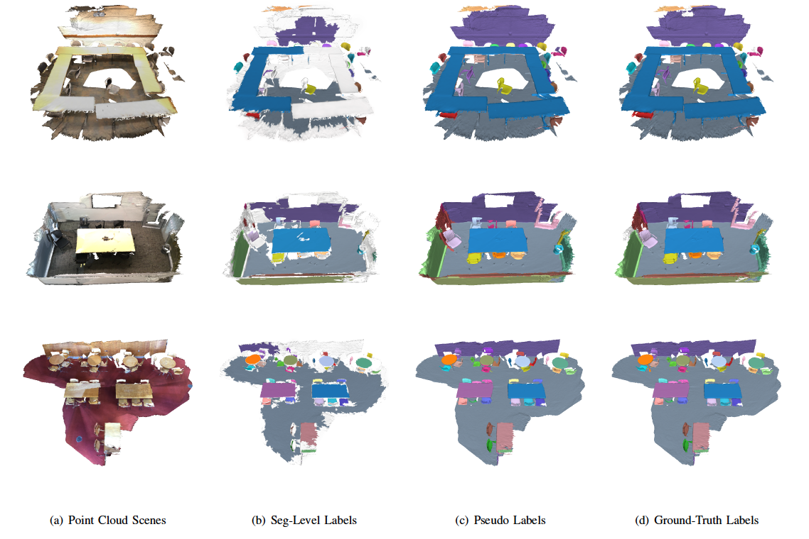

# 使用SegGroup产生虚假标签（Pseudo Label）

[[English]](README.md)

<p float="left">
    
</p>

本文件夹包含了从块级标签（Seg-level Label）产生点级虚假标签（Point-level Pseudo Label）的代码，得到的虚假标签可以被用于替代全监督学习中的真实标签（Ground-truth Labels），以训练一个标准的点云分割模型（Point Cloud Segmentation Model）。

&nbsp;

## 运行需求

- Python 3.7
- PyTorch 1.2
- CUDA 10.0
- Package: glob, h5py, sklearn, plyfile

&nbsp;

## 数据准备工作

你需要把程序运行目录改变至和ScanNet数据集相关的文件夹下。

```
cd dataset/scannet/
```

### 数据集

1. 从[官方网站](http://kaldir.vc.in.tum.de/scannet_benchmark/documentation)下载ScanNet数据集，你需要同意ScanNet数据集使用须知。
2. 使用下面的命令去准备数据集，其中`<scannet path>` 指ScanNet数据集的根目录，即包含`scans/`和`scans_test/`文件夹的目录。

``` 
python prepare_data.py --data_root <scannet path>
```

如果你不希望在数据处理过程中使用多重处理（Multiprocessing），你可以通过在脚本文件内注释和取消注释相关的代码来取消它。

### 过分割（Over-segmentation）

我们沿用了ScanNet数据集官方提供的过分割结果，其保存在数据集中`<scene name>_vh_clean.segs.json`文件内。ScanNet数据集的过分割结果同样被用于其真实标签的标注中，即在过分割块的基础上对其分别标注实例标签（Instance Label）和语义标签（Semantic Label），在[这里](https://github.com/ScanNet/ScanNet/tree/master/Segmentator)提供了ScanNet数据集使用的过分割工具。

### 块级标签（Seg-level Label）

共有四种方式`[manual, maxseg, mainseg, rand]`来产生块级标签。需要注意的是，如果一个实例包含了几个互不相连的部分（Disconnected Portion），我们在标注中对其分别进行标注。

#### 1. 手工标注（Manual Labeling）

我们在`dataset/scannet/manual_label/`路径下提供了在ScanNet数据集训练集上手工标注的结果，标注过程使用了我们自行设计的标注工具，具体代码在[antao97/SegGroup.annotator](https://github.com/antao97/SegGroup.annotator.git)。手工标注结果的文件名称`<scene name>.json`对应其在ScanNet数据集的场景名称，其内容的格式如下：

```
{
  <instance ID>: {
    <labeled segment ID>: <clicked point ID>
  },
  ...
}
```
其中`<instance ID>`是实例标签的ID，从0开始依次计数，`<labeled segment ID>`是所标注的过分割块的ID，ID属于过分割块ID总列表文件`<scene name>_vh_clean.segs.json`中的一个，`<clicked point ID>`是所标注的点的ID，即鼠标具体点击的点云中的一个点，ID在0到点云数量总数之间。因为我们允许当一个实例包含几个互不相连的部分时，对各个部分分别标注一个过分割块，因此在同一个实例`<instance ID>`中可能存在多个标注的过分割块`<labeled segment ID>`。

你需要使用下面的命令进一步处理他们，这种标注情况下标签风格`<label style>`是`manual`。

```
python prepare_weak_label.py --data_root <scannet path> --label_style manual --manual_label_path manual_label/
```

#### 2. 自动标注N个属于前N大（Top-N）的过分割块

使用下面的命令标注每个实例最大的一个过分割块，这种标注情况下标签风格`<label style>`是`maxseg`，对应文章中Table VIII内`Top-1 Segment`结果，和Table IX内`One Segment`结果。

```
python prepare_weak_label.py --data_root <scannet path> --label_style maxseg --anno_num 1
```

你可以通过使用下面的命令对每个实例标注`<N>`个前`<N>`大的过分割块，如果某个实例的过分割块数量小于`<N>`，那么其所有的过分割块都会被标注。这种标注情况下标签风格`<label style>`是`maxseg_a<N>`，对应文章中Table IX内`<N> Segments`结果。 

```
python prepare_weak_label.py --data_root <scannet path> --label_style maxseg --anno_num <N>
```

#### 3. 自动标注随机选择的N个属于前M大（Top-M）的过分割块，其中N小于M

使用下面的命令对每个实例标注`<N>`个过分割块，其随机选择于这个实例的前`<M>` 大的过分割块集合，如果某个实例的过分割块数量小于`<N>`，那么其所有的过分割块都会被标注。这种标注情况下标签风格`<label style>`是`mainseg_<M>_a<N>`。

```
python prepare_weak_label.py --data_root <scannet path> --label_style mainseg --anno_num <N> --main_num <M>
```

特殊的，你可以使用下面的命令对每个实例的前`<M>`大的过分割块中随机标注一个过分割块。需要注意的是，当`<M>`等于1时，标注效果和标注每个实例最大的过分割块是一致的。这种标注情况下标签风格`<label style>`是`mainseg_<M>`，对应文章中Table VIII内`Top-<M> Segment`结果。

```
python prepare_weak_label.py --data_root <scannet path> --label_style mainseg --anno_num 1 --main_num <M>
```


#### 4. 自动标注随机选择的一个过分割块

使用下面的命令对每个实例从所有过分割块中随机标注一个过分割块，这种标注情况下标签风格`<label style>`是`rand`，对应文章中Table VIII内`Rand Segment`结果。

```
python prepare_weak_label.py --data_root <scannet path> --label_style rand
```

### 完成数据准备工作

把程序运行目录改变至主目录。

```
cd ../../
```

&nbsp;

## 开始训练

在给定标签风格`<label style>`下使用对应的块级标注训练SegGroup网络，标签风格`<label style>`的定义可以在数据准备工作中找到。

```
python train.py --label_style <label style>
```

你可以通过下面的指令修改训练过程。

- `--exp_name <your exp name>` 实验名称，如果名称不给定则默认为`<日期>_<时间>`。
- `--resume` 从使实验`<your exp name>`中恢复最后一个检查点（Checkpoint），默认是`False`。
- `--epochs <your number>` 训练周期数量，默认是6。

你可以在[清华云盘](https://cloud.tsinghua.edu.cn/f/e439a45edbf84851a8c8/)或者[百度网盘](https://pan.baidu.com/s/1FMji6aT_vpIIC0cHsRUfAw)（密码：6xn8）下载我们训练好的模型，这个模型在训练中使用了手工标注的块级标签（Manually Labeled Seg-level Label）。

&nbsp;

## 产生虚假标签

使用下面的命令对实验`<your exp name>`产生用于后续实例分割（Instance Segmentation）的虚假标签。

```
python infer.py --exp_name <your exp name> --label_style <label style> --ins_infer
```

使用下面的命令对实验`<your exp name>`产生用于后续语义分割（Semantic Segmentation）的虚假标签。在后续的语义分割任务中，我们发现从SegGroup网络第二层提取的虚假语义标签效果最好，所以与上面的虚假实例标签不同，在这里我们只对SegGroup第二层提取虚假语义标签。

```
python infer.py --exp_name <your exp name> --label_style <label style> --sem_infer
```

在一个命令中你不能同时使用`--ins_infer`和`--sem_infer`指令。

&nbsp;

## 评估

使用下面的命令对实验`<your exp name>`产生的标签与真实标签在ScanNet数据集的训练集上进行比对，评估指标是IoU （Intersection over Union）。

```
python evaluate.py --exp_name <your exp name> --layer final --stage ins_infer
```

使用手工标注的块级标签产生的虚假语义标签（Pseudo Semantic Label）的mIoU是61.4%，各类别IoU结果在文章中Table II展示。

你可以通过下面的指令以评估某个SegGroup层产生虚假标签，或者训练过程产生的虚假标签。

- `--layer <your layer>` Which layer of pseudo labels to evaluate `[1, 2, 3, 4, final]`.
- `--stage <your stage>` Which stage of pseudo labels to evaluate `[epoch_1, ... , epoch_last, ins_infer, sem_infer]`.


&nbsp;

## 可视化

使用下面的命令可视化虚假实例标签（Pseudo Instance Label），可视化结果对应于文章中Fig. 5(c)的网格场景（Mesh）。

```
python visualize.py --mesh_path <mesh path> --label_path results/<label style>/<scene name>/infer_ins/final.ins.txt --label_type instance
```

使用下面的命令可视化虚假语义标签（Pseudo Semantic Label）。

```
python visualize.py --mesh_path <mesh path> --label_path results/<label style>/<scene name>/infer_ins/final.sem.txt --label_type semantic
```

使用下面的命令可视化在SegGroup网络内第`<L>`层的过分割块标签（Segment Label），可视化结果对应于文章中Fig. 3的网格场景（Mesh）。

```
python visualize.py --mesh_path <mesh path> --label_path results/<label style>/<scene name>/infer_ins/layer_<L>.seg.txt --label_type segment
```

指令的定义如下：

- `--mesh_path <mesh path>` 网格场景的路径，格式是`<scannet path>/scans/<scene name>/<scene name>_vh_clean_2.ply`。
- `--label_path <label path>` 标签的路径，格式是`results/<label style>/<scene name>/infer_ins/final.ins.txt`。
- `--label_type <label type>` 标签的种类，属于列表`[instance, semantic, segment]`中一项。

标签种类`<label type>`决定了可视化使用的颜色集合。对于语义标签，每个颜色均对应于一个语义类别。对于实例标签和过分割块标签，颜色集合内颜色是随机选择的。

如果可视化中颜色的分布不好看，你可以使用`--shuffle`命令打乱颜色分布，重新产生可视化。

- `--shuffle` 是否随机打乱可视化中颜色集合，默认是`False`。

